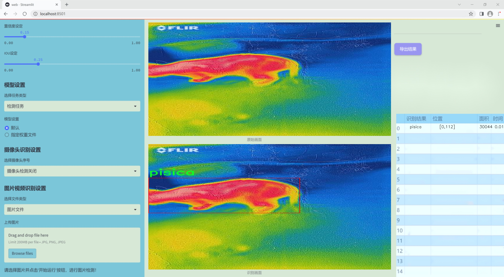
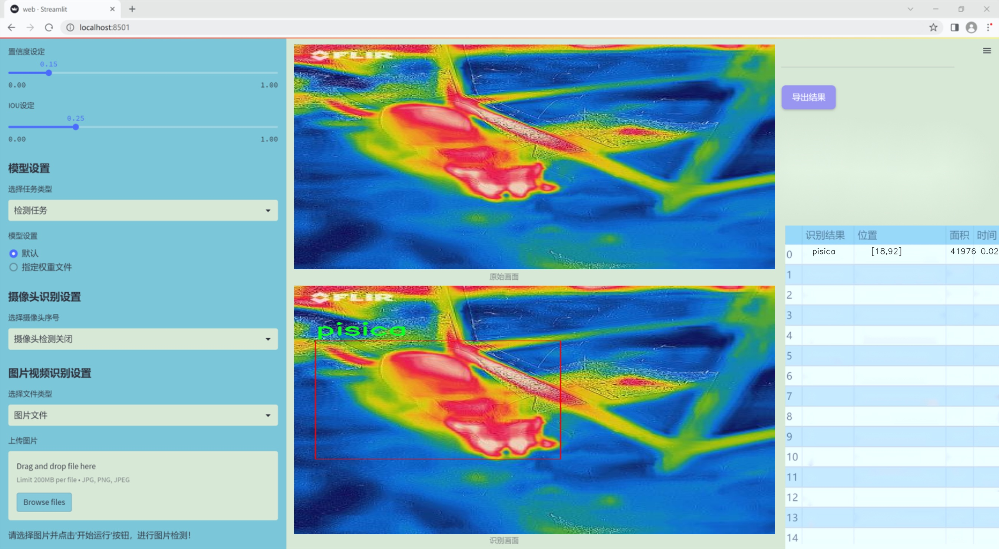
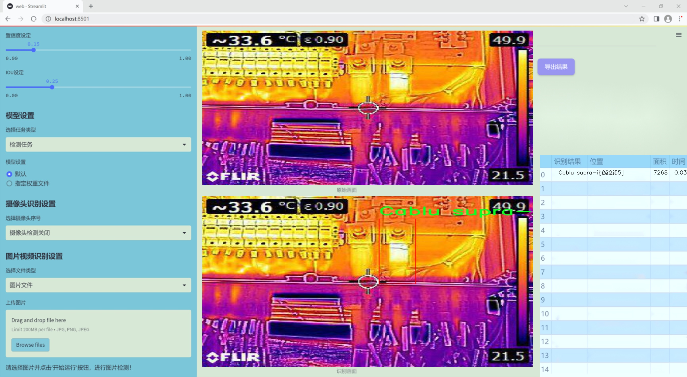
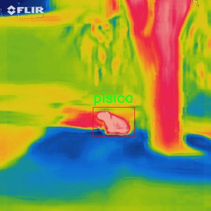
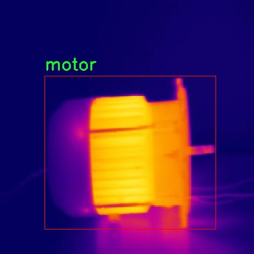
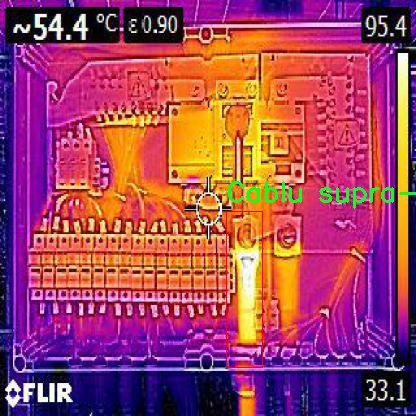
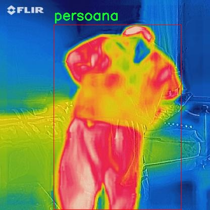
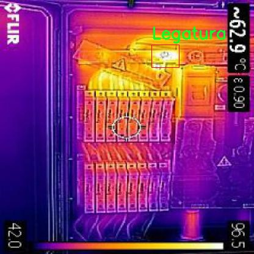

### 1.背景意义

研究背景与意义

随着科技的迅猛发展，红外光谱设备在工业、医疗及安全监控等领域的应用日益广泛。然而，设备的过热问题却成为了制约其性能和安全性的关键因素。过热不仅会导致设备的性能下降，还可能引发安全隐患，甚至造成设备的永久性损坏。因此，建立一个高效的过热检测系统显得尤为重要。基于深度学习的计算机视觉技术，尤其是目标检测算法的进步，为解决这一问题提供了新的思路。

YOLO（You Only Look Once）系列算法因其快速且准确的目标检测能力而受到广泛关注。YOLOv11作为该系列的最新版本，具备更强的特征提取能力和实时处理能力，能够在复杂环境中有效识别多种目标。通过对YOLOv11的改进，我们可以针对红外光谱设备的特定需求，设计出一套高效的过热检测系统。

本研究所使用的数据集包含10个类别的标注图像，涵盖了设备过热可能涉及的多种情况，如过热的电缆、组件及其他相关物体。这些类别的多样性使得模型能够在不同场景下进行有效的学习和识别，从而提高检测的准确性和鲁棒性。数据集的规模（788张图像）虽然相对较小，但通过合理的数据增强和模型训练策略，仍然可以实现良好的检测效果。

本项目的意义不仅在于提升红外光谱设备的安全性和可靠性，更在于推动计算机视觉技术在工业应用中的深入发展。通过构建基于改进YOLOv11的过热检测系统，我们希望为相关领域提供一种高效、可行的解决方案，同时为未来的研究和应用奠定基础。

### 2.视频效果

[2.1 视频效果](https://www.bilibili.com/video/BV1ACBYYTETL/)

### 3.图片效果







##### [项目涉及的源码数据来源链接](https://kdocs.cn/l/cszuIiCKVNis)**

注意：本项目提供训练的数据集和训练教程,由于版本持续更新,暂不提供权重文件（best.pt）,请按照6.训练教程进行训练后实现上图演示的效果。

### 4.数据集信息

##### 4.1 本项目数据集类别数＆类别名

nc: 10
names: ['Cablu supra-incalzit', 'Caine', 'Compenenta incalzita', 'Componenta incalzita', 'Legatura', 'SFH', 'SOC', 'motor', 'persoana', 'pisica']


该项目为【目标检测】数据集，请在【训练教程和Web端加载模型教程（第三步）】这一步的时候按照【目标检测】部分的教程来训练

##### 4.2 本项目数据集信息介绍

本项目数据集信息介绍

本项目旨在改进YOLOv11的红外光谱设备过热检测系统，所使用的数据集围绕“licenta”主题构建，涵盖了多种与过热检测相关的类别。数据集中包含10个类别，具体包括：‘Cablu supra-incalzit’（过热电缆）、‘Caine’（犬类）、‘Compenenta incalzita’（加热组件）、‘Componenta incalzita’（加热部件）、‘Legatura’（连接件）、‘SFH’（热敏元件）、‘SOC’（系统级芯片）、‘motor’（电机）、‘persoana’（人类）以及‘pisica’（猫类）。这些类别的选择旨在全面覆盖可能导致设备过热的各种因素，从而为系统的训练提供丰富的样本。

数据集中的图像数据经过精心标注，确保每个类别的特征在红外光谱下都能被准确识别。通过多样化的场景和环境设置，数据集不仅包括静态图像，还涵盖了动态场景，模拟了真实世界中可能出现的各种情况。这种多样性有助于提高YOLOv11模型在实际应用中的鲁棒性和准确性，确保其能够在不同条件下有效识别过热现象。

此外，数据集的构建还考虑到了不同物体之间的相互作用，例如人类与设备的接触、动物对设备的影响等。这些复杂的交互关系在过热检测中可能扮演重要角色，因此在数据集中给予了充分的体现。通过对这些类别的综合分析和深度学习模型的训练，期望能够显著提升红外光谱设备在过热检测方面的性能，为相关领域的安全监测提供有力支持。











### 5.全套项目环境部署视频教程（零基础手把手教学）

[5.1 所需软件PyCharm和Anaconda安装教程（第一步）](https://www.bilibili.com/video/BV1BoC1YCEKi/?spm_id_from=333.999.0.0&vd_source=bc9aec86d164b67a7004b996143742dc)


[5.2 安装Python虚拟环境创建和依赖库安装视频教程（第二步）](https://www.bilibili.com/video/BV1ZoC1YCEBw?spm_id_from=333.788.videopod.sections&vd_source=bc9aec86d164b67a7004b996143742dc)

### 6.改进YOLOv11训练教程和Web_UI前端加载模型教程（零基础手把手教学）

[6.1 改进YOLOv11训练教程和Web_UI前端加载模型教程（第三步）](https://www.bilibili.com/video/BV1BoC1YCEhR?spm_id_from=333.788.videopod.sections&vd_source=bc9aec86d164b67a7004b996143742dc)


按照上面的训练视频教程链接加载项目提供的数据集，运行train.py即可开始训练



     Epoch   gpu_mem       box       obj       cls    labels  img_size
     1/200     20.8G   0.01576   0.01955  0.007536        22      1280: 100%|██████████| 849/849 [14:42<00:00,  1.04s/it]
               Class     Images     Labels          P          R     mAP@.5 mAP@.5:.95: 100%|██████████| 213/213 [01:14<00:00,  2.87it/s]
                 all       3395      17314      0.994      0.957      0.0957      0.0843

     Epoch   gpu_mem       box       obj       cls    labels  img_size
     2/200     20.8G   0.01578   0.01923  0.007006        22      1280: 100%|██████████| 849/849 [14:44<00:00,  1.04s/it]
               Class     Images     Labels          P          R     mAP@.5 mAP@.5:.95: 100%|██████████| 213/213 [01:12<00:00,  2.95it/s]
                 all       3395      17314      0.996      0.956      0.0957      0.0845

     Epoch   gpu_mem       box       obj       cls    labels  img_size
     3/200     20.8G   0.01561    0.0191  0.006895        27      1280: 100%|██████████| 849/849 [10:56<00:00,  1.29it/s]
               Class     Images     Labels          P          R     mAP@.5 mAP@.5:.95: 100%|███████   | 187/213 [00:52<00:00,  4.04it/s]
                 all       3395      17314      0.996      0.957      0.0957      0.0845


###### [项目数据集下载链接](https://kdocs.cn/l/cszuIiCKVNis)

### 7.原始YOLOv11算法讲解

YOLO11采用改进的骨干和颈部架构，增强了特征提取能力，提高了物体检测的精确度和复杂任务的表现。YOLO11引入精炼的架构设计和优化的训练流程，实现更快的处理速度，同时保持精度和性能之间的最佳平衡。通过模型设计的进步，YOLO11m在COCO数据集上实现了更高的均值平均精度（mAP），同时使用比YOLOv8m少22%的参数，使其在不妥协准确性的情况下更加计算高效。YOLO11可以无缝部署在各种环境中，包括边缘设备、云平台以及支持NVIDIA
GPU的系统，确保最大灵活性。无论是物体检测、实例分割、图像分类、姿态估计，还是定向物体检测（OBB），YOLO11都旨在应对多样的计算机视觉挑战。


##### **Ultralytics YOLO11相比于之前版本的主要改进有哪些？**

Ultralytics YOLO11在其前身基础上引入了几项重要进步。主要改进包括：

  1. **增强的特征提取** ：YOLO11采用改进的骨干和颈部架构，增强了特征提取能力，提高了物体检测的精确度。
  2.  **优化的效率和速度** ：精炼的架构设计和优化的训练流程实现了更快的处理速度，同时保持了准确性和性能之间的平衡。
  3.  **更高的准确性与更少的参数** ：YOLO11m在COCO数据集上实现了更高的均值平均精度（mAP），同时使用比YOLOv8m少22%的参数，使其在不妥协准确性的情况下更加计算高效。
  4.  **环境适应性强** ：YOLO11可以在多种环境中部署，包括边缘设备、云平台以及支持NVIDIA GPU的系统。
  5.  **支持广泛的任务** ：YOLO11支持多种计算机视觉任务，如物体检测、实例分割、图像分类、姿态估计和定向物体检测（OBB）。

我们先来看一下其网络结构有什么变化，可以看出，相比较于YOLOv8模型，其将CF2模块改成C3K2，同时在SPPF模块后面添加了一个C2PSA模块，且将YOLOv10的head思想引入到YOLO11的head中，使用深度可分离的方法，减少冗余计算，提高效率。下面我们来详细看一下这两个模块的结构是怎么构成的，以及它们为什么要这样设计


##### C3K2的网络结构

从下面图中我们可以看到，C3K2模块其实就是C2F模块转变出来的，它代码中有一个设置，就是当c3k这个参数为FALSE的时候，C3K2模块就是C2F模块，也就是说它的Bottleneck是普通的Bottleneck；反之当它为true的时候，将Bottleneck模块替换成C3模块。


##### C2PSA的网络结构

` `C2PSA是对 `C2f` 模块的扩展，它结合了PSA(Pointwise Spatial
Attention)块，用于增强特征提取和注意力机制。通过在标准 `C2f` 模块中引入 PSA
块，C2PSA实现了更强大的注意力机制，从而提高了模型对重要特征的捕捉能力。


##### **C2f 模块回顾：**

**** C2f模块是一个更快的 CSP（Cross Stage Partial）瓶颈实现，它通过两个卷积层和多个 Bottleneck
块进行特征提取。相比传统的 CSPNet，C2f 优化了瓶颈层的结构，使得计算速度更快。在 C2f中，`cv1` 是第一个 1x1
卷积，用于减少通道数；`cv2` 是另一个 1x1 卷积，用于恢复输出通道数。而 `n` 是一个包含 Bottleneck 块的数量，用于提取特征。

##### **C2PSA 模块的增强** ：

**C2PSA** 扩展了 C2f，通过引入PSA( **Position-Sensitive Attention)**
，旨在通过多头注意力机制和前馈神经网络来增强特征提取能力。它可以选择性地添加残差结构（shortcut）以优化梯度传播和网络训练效果。同时，使用FFN
可以将输入特征映射到更高维的空间，捕获输入特征的复杂非线性关系，允许模型学习更丰富的特征表示。

##### head部分

YOLO11在head部分的cls分支上使用深度可分离卷积 ，具体代码如下，cv2边界框回归分支，cv3分类分支。

    
    
     self.cv2 = nn.ModuleList(
                nn.Sequential(Conv(x, c2, 3), Conv(c2, c2, 3), nn.Conv2d(c2, 4 * self.reg_max, 1)) for x in ch
            )
            self.cv3 = nn.ModuleList(
                nn.Sequential(
                    nn.Sequential(DWConv(x, x, 3), Conv(x, c3, 1)),
                    nn.Sequential(DWConv(c3, c3, 3), Conv(c3, c3, 1)),
                    nn.Conv2d(c3, self.nc, 1),
                )
                for x in ch
            )


### 8.200+种全套改进YOLOV11创新点原理讲解

#### 8.1 200+种全套改进YOLOV11创新点原理讲解大全

由于篇幅限制，每个创新点的具体原理讲解就不全部展开，具体见下列网址中的改进模块对应项目的技术原理博客网址【Blog】（创新点均为模块化搭建，原理适配YOLOv5~YOLOv11等各种版本）

[改进模块技术原理博客【Blog】网址链接](https://gitee.com/qunmasj/good)


#### 8.2 精选部分改进YOLOV11创新点原理讲解

###### 这里节选部分改进创新点展开原理讲解(完整的改进原理见上图和[改进模块技术原理博客链接](https://gitee.com/qunmasj/good)【如果此小节的图加载失败可以通过CSDN或者Github搜索该博客的标题访问原始博客，原始博客图片显示正常】

### 高效网络架构 CloAtt简介
众所周知，自从 ViTs 提出后，Transformer 基本横扫各大 CV 主流任务，包括视觉识别、目标检测和语义分割等。然而，一个比较棘手的问题就是这个架构参数量和计算量太大，所以一直被广受诟病。因此，后续有不少工作都是朝着这个方向去改进，例如 Swin-Transformer 在局部非重叠窗口中进行注意力计算，而 PVT 中则是使用平均池化来合并 token 以进一步压缩耗时。然而，这些 ViTs 由于其参数量太大以及高 FLOPs 并不适合部署到移动设备。如果我们直接缩小到适合移动设备的尺寸时，它们的性能又会显著降低。


#### MobileViT
因此，出现了不少工作聚焦于探索轻量级的视觉变换器，使 ViTs 适用于移动设备，CVHub 此前也介绍过不少的工作，大家有兴趣可以翻阅历史文章读读。例如，苹果团队提出的 MobileViT 研究了如何将 CNN 与 Transformer 相结合，而另一个工作 MobileFormer 则将轻量级的 MobileNet 与 Transformer 进行融合。此外，最新提出的 EdgeViT 提出了一个局部-全局-局部模块来聚合信息。以上工作的目标都是设计具有高性能、较少参数和低 FLOPs 的移动端友好型模型。


#### EdgeViT
然而，作者从频域编码的角度认为，在现有的轻量级模型中，大多数方法只关注设计稀疏注意力，以有效地处理低频全局信息，而使用相对简单的方法处理高频局部信息。具体而言，大多数模型如 EdgeViT 和 MobileViT，只是简单使用原始卷积提取局部表示，这些方法仅使用卷积中的全局共享权重处理高频本地信息。其他方法，如 LVT ，则是首先将标记展开到窗口中，然后使用窗口内的注意力获得高频信息。这些方法仅使用特定于每个 Token 的上下文感知权重进行局部感知。


#### LVT
虽然上述轻量级模型在多个数据集上取得了良好的结果，但没有一种方法尝试设计更有效的方法，即利用共享和上下文感知权重的优势来处理高频局部信息。基于共享权重的方法，如传统的卷积神经网络，具有平移等变性的特征。与它们不同，基于上下文感知权重的方法，如 LVT 和 NAT，具有可以随输入内容变化的权重。这两种类型的权重在局部感知中都有自己的优势。
#### NAT


受该博客的启发，本文设计了一种轻量级视觉变换器——CloAtt，其利用了上下文感知的局部增强。特别地，CloAtt 采用了双分支设计结构。
#### 局部分支
在局部分支中，本文引入了一个精心设计的 AttnConv，一种简单而有效的卷积操作符，它采用了注意力机制的风格。所提出的 AttnConv 有效地融合了共享权重和上下文感知权重，以聚合高频的局部信息。具体地，AttnConv 首先使用深度卷积（DWconv）提取局部表示，其中 DWconv 具有共享权重。然后，其使用上下文感知权重来增强局部特征。与 Non-Local 等生成上下文感知权重的方法不同，AttnConv 使用门控机制生成上下文感知权重，引入了比常用的注意力机制更强的非线性。此外，AttnConv 将卷积算子应用于 Query 和 Key 以聚合局部信息，然后计算 Q 和 K 的哈达玛积，并对结果进行一系列线性或非线性变换，生成范围在 [-1,1] 之间的上下文感知权重。值得注意的是，AttnConv 继承了卷积的平移等变性，因为它的所有操作都基于卷积。
#### 全局分支
在全局分支中则使用了传统的注意力机制，但对 K 和 V 进行了下采样以减少计算量，从而捕捉低频全局信息。最后，CloFormer 通过简单的方法将局部分支和全局分支的输出进行融合，从而使模型能够同时捕捉高频和低频信息。总的来说，CloFormer 的设计能够同时发挥共享权重和上下文感知权重的优势，提高其局部感知的能力，使其在图像分类、物体检测和语义分割等多个视觉任务上均取得了优异的性能。
如上图2所示，CloFormer 共包含一个卷积主干和四个 stage，每个 stage you Clo 模块 和 ConvFFN 组合而成的模块堆叠而成 。具体得，首先将输入图像通过卷积主干传递，以获取 token 表示。该主干由四个卷积组成，每个卷积的步长依次为2、2、1和1。接下来，tokens 经历四个 Clo 块和 ConvFFN 阶段，以提取分层特征。最后，再利用全局平均池化和全连接层生成预测结果。可以看出，整个架构非常简洁，支持即插即用！


#### ConvFFN
为了将局部信息融入 FFN 过程中，本文采用 ConvFFN 替换了常用的 FFN。ConvFFN 和常用的 FFN 的主要区别在于，ConvFFN 在 GELU 激活函数之后使用了深度卷积（DWconv），从而使 ConvFFN 能够聚合局部信息。由于DWconv 的存在，可以直接在 ConvFFN 中进行下采样而不需要引入 PatchMerge 模块。CloFormer 使用了两种ConvFFN。第一种是在阶段内的 ConvFFN，它直接利用跳跃连接。另一种是连接两个阶段的 ConvFFN，主要用于下采样操作。
#### Clo block
CloFormer 中的 Clo块 是非常关键的组件。每个 Clo 块由一个局部分支和一个全局分支组成。在全局分支中，我们首先下采样 K 和 V，然后对 Q、K 和 V 进行标准的 attention 操作，以提取低频全局信息。
虽然全局分支的设计能够有效减少注意力机制所需的浮点运算次数，并且能够获得全局的感受野。然而，它在处理高频局部信息方面的能力不足。为了解决这个问题，CloFormer 引入了局部分支，并使用 AttnConv 对高频局部信息进行处理。AttnConv 可以融合共享权重和上下文感知权重，能够更好地处理高频局部信息。因此，CloFormer 结合了全局和局部的优势来提高图像分类性能。下面我们重点讲下 AttnConv 。
#### AttnConv
AttnConv 是一个关键模块，使得所提模型能够获得高性能。它结合了一些标准的 attention 操作。具体而言，在AttnConv 中，我们首先进行线性变换以获得 Q、K和V。在进行线性变换之后，我们再对 V 进行共享权重的局部特征聚合。然后，基于处理后的 V 和 Q ，K 进行上下文感知的局部增强。具体流程可对照流程图理解，我们可以将其拆解成三个步骤。
#### Local Feature Aggregation
为了简单起见，本文直接使用一个简单的深度卷积（DWconv）来对 V 进行局部信息聚合。
#### Context-aware Local Enhancement
在将具有共享权重的局部信息整合到 V 中后，我们结合 Q 和 K 生成上下文感知权重。值得注意的是，我们使用了与局部自注意力不同的方法，该方法更加简洁。具体而言，我们首先使用两个 DWconv 对 Q 和 K 分别进行局部信息聚合。然后，我们计算 Q 和 K 的 Hadamard 乘积，并对结果进行一系列转换，以获取在 -1 到 1 之间的上下文感知权重。最后，我们使用生成的权重来增强局部特征。
#### Fusion with Global Branch
在整个 CloFormer 中，我们使用一种简单直接的方法来将局部分支和全局分支的输出进行融合。具体而言，本文是通过将这两个输出在通道维度上进行直接拼接，然后再通过一个 FC 层聚合这些特征并结合残差输出。
最后，上图展示了三种不同的方法。相比于传统卷积，AttnConv 中的上下文感知权重使得模型能够更好地适应输入内容。相比于局部自注意力机制，引入共享权重使得模型能够更好地处理高频信息，从而提高性能。此外，生成上下文感知权重的方法引入了更强的非线性性，也提高了性能。需要注意的是，AttnConv 中的所有操作都基于卷积，保持了卷积的平移等变性特性。


### 9.系统功能展示

图9.1.系统支持检测结果表格显示

  图9.2.系统支持置信度和IOU阈值手动调节

  图9.3.系统支持自定义加载权重文件best.pt(需要你通过步骤5中训练获得)

  图9.4.系统支持摄像头实时识别

  图9.5.系统支持图片识别

  图9.6.系统支持视频识别

  图9.7.系统支持识别结果文件自动保存

  图9.8.系统支持Excel导出检测结果数据


### 10. YOLOv11核心改进源码讲解

#### 10.1 SMPConv.py

以下是对代码中最核心部分的提取和详细中文注释：

```python
import torch
import torch.nn as nn
import torch.nn.functional as F

# 定义一个函数用于生成相对位置的坐标
def rel_pos(kernel_size):
    # 生成一个从-1到1的线性空间，大小为kernel_size
    tensors = [torch.linspace(-1, 1, steps=kernel_size) for _ in range(2)]
    # 创建网格坐标
    kernel_coord = torch.stack(torch.meshgrid(*tensors), dim=-0)
    kernel_coord = kernel_coord.unsqueeze(0)  # 增加一个维度
    return kernel_coord

# 定义SMPConv类，继承自nn.Module
class SMPConv(nn.Module):
    def __init__(self, planes, kernel_size, n_points, stride, padding, groups):
        super().__init__()

        self.planes = planes  # 输出通道数
        self.kernel_size = kernel_size  # 卷积核大小
        self.n_points = n_points  # 关键点数量
        self.init_radius = 2 * (2/kernel_size)  # 初始化半径

        # 生成卷积核坐标
        kernel_coord = rel_pos(kernel_size)
        self.register_buffer('kernel_coord', kernel_coord)  # 注册为缓冲区，不会被优化

        # 权重坐标初始化
        weight_coord = torch.empty(1, n_points, 2)
        nn.init.trunc_normal_(weight_coord, std=0.2, a=-1., b=1.)  # 截断正态分布初始化
        self.weight_coord = nn.Parameter(weight_coord)  # 注册为可学习参数

        # 半径参数初始化
        self.radius = nn.Parameter(torch.empty(1, n_points).unsqueeze(-1).unsqueeze(-1))
        self.radius.data.fill_(value=self.init_radius)  # 填充初始半径

        # 权重初始化
        weights = torch.empty(1, planes, n_points)
        nn.init.trunc_normal_(weights, std=.02)  # 截断正态分布初始化
        self.weights = nn.Parameter(weights)  # 注册为可学习参数

    def forward(self, x):
        # 生成卷积核
        kernels = self.make_kernels().unsqueeze(1)
        x = x.contiguous()  # 确保输入是连续的
        kernels = kernels.contiguous()  # 确保卷积核是连续的

        # 根据输入数据类型选择相应的深度可分离卷积实现
        if x.dtype == torch.float32:
            x = _DepthWiseConv2dImplicitGEMMFP32.apply(x, kernels)
        elif x.dtype == torch.float16:
            x = _DepthWiseConv2dImplicitGEMMFP16.apply(x, kernels)
        else:
            raise TypeError("Only support fp32 and fp16, get {}".format(x.dtype))
        return x        

    def make_kernels(self):
        # 计算卷积核的差异
        diff = self.weight_coord.unsqueeze(-2) - self.kernel_coord.reshape(1, 2, -1).transpose(1, 2)  # [1, n_points, kernel_size^2, 2]
        diff = diff.transpose(2, 3).reshape(1, self.n_points, 2, self.kernel_size, self.kernel_size)  # 重塑形状
        diff = F.relu(1 - torch.sum(torch.abs(diff), dim=2) / self.radius)  # 计算权重差异

        # 计算卷积核
        kernels = torch.matmul(self.weights, diff.reshape(1, self.n_points, -1))  # [1, planes, kernel_size*kernel_size]
        kernels = kernels.reshape(1, self.planes, *self.kernel_coord.shape[2:])  # 重塑形状
        kernels = kernels.squeeze(0)  # 去掉多余的维度
        kernels = torch.flip(kernels.permute(0, 2, 1), dims=(1,))  # 反转卷积核
        return kernels

# 定义SMPCNN类，使用SMPConv
class SMPCNN(nn.Module):
    def __init__(self, in_channels, out_channels, kernel_size, stride, groups, n_points=None, n_points_divide=4):
        super().__init__()
        self.kernel_size = kernel_size
        if n_points is None:
            n_points = int((kernel_size**2) // n_points_divide)  # 计算关键点数量

        padding = kernel_size // 2  # 计算填充
        self.smp = conv_bn(in_channels=in_channels, out_channels=out_channels, kernel_size=kernel_size,
                           stride=stride, padding=padding, dilation=1, groups=groups, n_points=n_points)

        self.small_kernel = 5  # 小卷积核大小
        self.small_conv = Conv(in_channels, out_channels, self.small_kernel, stride, self.small_kernel // 2, groups, act=False)

    def forward(self, inputs):
        out = self.smp(inputs)  # 通过SMP卷积
        out += self.small_conv(inputs)  # 加上小卷积的输出
        return out

# 定义SMPBlock类，使用SMPCNN
class SMPBlock(nn.Module):
    def __init__(self, in_channels, dw_channels, lk_size, drop_path, n_points=None, n_points_divide=4):
        super().__init__()
        self.pw1 = conv_bn_relu(in_channels, dw_channels, 1, 1, 0, groups=1)  # 1x1卷积
        self.pw2 = conv_bn(dw_channels, in_channels, 1, 1, 0, groups=1)  # 1x1卷积
        self.large_kernel = SMPCNN(in_channels=dw_channels, out_channels=dw_channels, kernel_size=lk_size,
                                   stride=1, groups=dw_channels, n_points=n_points, n_points_divide=n_points_divide)
        self.lk_nonlinear = nn.ReLU()  # 激活函数
        self.drop_path = DropPath(drop_path) if drop_path > 0. else nn.Identity()  # 路径丢弃

    def forward(self, x):
        out = self.pw1(x)  # 通过第一个1x1卷积
        out = self.large_kernel(out)  # 通过大卷积
        out = self.lk_nonlinear(out)  # 激活
        out = self.pw2(out)  # 通过第二个1x1卷积
        return x + self.drop_path(out)  # 残差连接
```

### 代码核心部分说明：
1. **SMPConv**: 这是一个自定义的卷积层，使用相对位置编码和动态生成卷积核。它通过计算权重坐标和卷积核坐标之间的差异来生成卷积核。
2. **SMPCNN**: 这个类将SMPConv与一个小卷积结合在一起，通过残差连接增强特征提取能力。
3. **SMPBlock**: 这是一个模块化的构建块，结合了多个卷积层和激活函数，支持路径丢弃，增强了网络的深度和表现力。

这些核心部分构成了整个网络的基础，能够有效地进行特征提取和信息传递。

这个文件定义了一个名为 `SMPConv` 的卷积模块及其相关的结构，主要用于深度学习中的卷积神经网络。文件中使用了 PyTorch 框架，包含了一些自定义的卷积层和网络模块。

首先，文件导入了必要的库，包括 PyTorch 的核心模块和一些自定义的模块。`SMPConv` 类是这个文件的核心，继承自 `nn.Module`。在 `__init__` 方法中，初始化了一些参数，包括输出通道数、卷积核大小、点数、步幅、填充和分组数。接着，定义了一个函数 `rel_pos`，用于生成卷积核的相对位置坐标。

在 `SMPConv` 的构造函数中，使用 `rel_pos` 生成卷积核的坐标，并注册为缓冲区。接着，初始化权重坐标和半径，并定义权重参数。权重的初始化使用了截断正态分布，确保权重在一定范围内。

`forward` 方法是前向传播的实现。在这个方法中，首先调用 `make_kernels` 方法生成卷积核，然后根据输入数据的类型选择不同的深度可分离卷积实现。这个实现通过 `_DepthWiseConv2dImplicitGEMMFP16` 和 `_DepthWiseConv2dImplicitGEMMFP32` 进行加速，支持 FP16 和 FP32 数据类型。

`make_kernels` 方法负责生成卷积核。它计算权重坐标与卷积核坐标之间的差异，并通过 ReLU 激活函数处理这些差异，最终生成加权的卷积核。

此外，`radius_clip` 方法用于限制半径的范围，确保其在指定的最小值和最大值之间。

文件中还定义了一些辅助函数，例如 `get_conv2d` 用于根据条件选择使用 `SMPConv` 或标准的 `nn.Conv2d`，`get_bn` 用于选择批归一化层，`conv_bn` 和 `conv_bn_relu` 用于构建包含卷积、批归一化和激活函数的序列模块。

`SMPCNN` 类是一个组合卷积模块，包含了 `SMPConv` 和一个小卷积层。它在前向传播中将两者的输出相加，形成最终的输出。

`SMPCNN_ConvFFN` 类实现了一个前馈网络，包含了两个逐点卷积层和一个非线性激活函数，最后通过 DropPath 进行残差连接。

最后，`SMPBlock` 类结合了前面定义的模块，构建了一个完整的块结构，包含了逐点卷积、深度可分离卷积和残差连接。整体结构设计旨在提高卷积神经网络的表达能力和计算效率。

通过这些模块的组合，整个文件实现了一个灵活且高效的卷积神经网络结构，适用于各种深度学习任务。

#### 10.2 metaformer.py

以下是代码中最核心的部分，并附上详细的中文注释：

```python
import torch
import torch.nn as nn
import torch.nn.functional as F

class MF_Attention(nn.Module):
    """
    自注意力机制（Self-Attention）实现，源自Transformer模型。
    """
    def __init__(self, dim, head_dim=32, num_heads=None, qkv_bias=False,
                 attn_drop=0., proj_drop=0., proj_bias=False):
        super().__init__()

        # 头的维度
        self.head_dim = head_dim
        # 缩放因子
        self.scale = head_dim ** -0.5

        # 计算头的数量
        self.num_heads = num_heads if num_heads else dim // head_dim
        if self.num_heads == 0:
            self.num_heads = 1
        
        # 注意力的维度
        self.attention_dim = self.num_heads * self.head_dim

        # Q、K、V的线性变换
        self.qkv = nn.Linear(dim, self.attention_dim * 3, bias=qkv_bias)
        # 注意力的dropout
        self.attn_drop = nn.Dropout(attn_drop)
        # 输出的线性变换
        self.proj = nn.Linear(self.attention_dim, dim, bias=proj_bias)
        # 输出的dropout
        self.proj_drop = nn.Dropout(proj_drop)

    def forward(self, x):
        # 获取输入的批量大小、高度、宽度和通道数
        B, H, W, C = x.shape
        N = H * W  # 计算总的token数量

        # 计算Q、K、V
        qkv = self.qkv(x).reshape(B, N, 3, self.num_heads, self.head_dim).permute(2, 0, 3, 1, 4)
        q, k, v = qkv.unbind(0)  # 分离Q、K、V

        # 计算注意力权重
        attn = (q @ k.transpose(-2, -1)) * self.scale
        attn = attn.softmax(dim=-1)  # 归一化为概率分布
        attn = self.attn_drop(attn)  # 应用dropout

        # 计算输出
        x = (attn @ v).transpose(1, 2).reshape(B, H, W, self.attention_dim)
        x = self.proj(x)  # 投影到原始维度
        x = self.proj_drop(x)  # 应用dropout
        return x

class Mlp(nn.Module):
    """ 
    多层感知机（MLP）实现，通常用于MetaFormer模型。
    """
    def __init__(self, dim, mlp_ratio=4, out_features=None, act_layer=nn.ReLU, drop=0., bias=False):
        super().__init__()
        in_features = dim
        out_features = out_features or in_features
        hidden_features = int(mlp_ratio * in_features)

        # 定义第一层线性变换
        self.fc1 = nn.Linear(in_features, hidden_features, bias=bias)
        self.act = act_layer()  # 激活函数
        self.drop1 = nn.Dropout(drop)  # dropout层
        # 定义第二层线性变换
        self.fc2 = nn.Linear(hidden_features, out_features, bias=bias)
        self.drop2 = nn.Dropout(drop)  # dropout层

    def forward(self, x):
        x = self.fc1(x)  # 第一层线性变换
        x = self.act(x)  # 激活
        x = self.drop1(x)  # 应用dropout
        x = self.fc2(x)  # 第二层线性变换
        x = self.drop2(x)  # 应用dropout
        return x

class MetaFormerBlock(nn.Module):
    """
    MetaFormer块的实现，包含自注意力和MLP。
    """
    def __init__(self, dim,
                 token_mixer=nn.Identity, mlp=Mlp,
                 norm_layer=nn.LayerNorm,
                 drop=0., drop_path=0.,
                 layer_scale_init_value=None, res_scale_init_value=None):
        super().__init__()

        # 归一化层
        self.norm1 = norm_layer(dim)
        # 令牌混合器
        self.token_mixer = token_mixer(dim=dim, drop=drop)
        # DropPath层
        self.drop_path1 = nn.Identity() if drop_path <= 0. else nn.Dropout(drop_path)
        # 层缩放
        self.layer_scale1 = nn.Identity() if layer_scale_init_value is None else nn.Parameter(torch.ones(dim) * layer_scale_init_value)
        self.res_scale1 = nn.Identity() if res_scale_init_value is None else nn.Parameter(torch.ones(dim) * res_scale_init_value)

        # 第二个归一化层
        self.norm2 = norm_layer(dim)
        # MLP
        self.mlp = mlp(dim=dim, drop=drop)
        self.drop_path2 = nn.Identity() if drop_path <= 0. else nn.Dropout(drop_path)
        self.layer_scale2 = nn.Identity() if layer_scale_init_value is None else nn.Parameter(torch.ones(dim) * layer_scale_init_value)
        self.res_scale2 = nn.Identity() if res_scale_init_value is None else nn.Parameter(torch.ones(dim) * res_scale_init_value)

    def forward(self, x):
        # 前向传播
        x = self.norm1(x)  # 归一化
        x = self.token_mixer(x)  # 令牌混合
        x = self.drop_path1(x)  # 应用DropPath
        x = self.layer_scale1(x) + x  # 应用层缩放和残差连接

        x = self.norm2(x)  # 第二次归一化
        x = self.mlp(x)  # MLP处理
        x = self.drop_path2(x)  # 应用DropPath
        x = self.layer_scale2(x) + x  # 应用层缩放和残差连接
        return x
```

### 代码核心部分说明：
1. **MF_Attention**：实现了自注意力机制，输入为特征图，输出为经过注意力机制处理后的特征图。通过线性变换计算Q、K、V，并计算注意力权重。
  
2. **Mlp**：实现了一个简单的多层感知机，包含两层线性变换和激活函数，适用于特征的非线性变换。

3. **MetaFormerBlock**：将自注意力和MLP结合在一起，形成一个完整的MetaFormer块。通过归一化、令牌混合、DropPath和层缩放等机制，增强模型的表达能力。

这个程序文件`metaformer.py`实现了一些用于构建MetaFormer模型的基本组件，主要是各种神经网络模块。这些模块包括注意力机制、激活函数、归一化层、卷积层以及MLP（多层感知机）等，都是在深度学习中常用的构建块。

首先，文件中定义了一个`Scale`类，用于通过元素乘法对输入向量进行缩放。这个类的构造函数接受一个维度参数和一个初始值，创建一个可训练的参数。

接下来，定义了几个激活函数的变体，包括`SquaredReLU`和`StarReLU`。`SquaredReLU`是对ReLU激活函数的平方形式，而`StarReLU`则在ReLU的基础上添加了可学习的缩放和偏置。

`MF_Attention`类实现了标准的自注意力机制，主要用于Transformer模型。它通过线性变换生成查询、键和值，然后计算注意力权重，并对值进行加权求和，最后通过线性层进行投影。

`RandomMixing`类则实现了一种随机混合的机制，通过一个随机矩阵对输入进行线性变换，生成新的特征表示。

`LayerNormGeneral`类是一个通用的层归一化实现，可以适应不同的输入形状和归一化维度。它允许用户指定是否使用缩放和偏置。

`SepConv`类实现了反向可分离卷积，主要用于提高模型的效率。它由两个线性层和一个深度卷积层组成。

`Pooling`类实现了一种特定的池化操作，旨在从输入中提取特征并减去原始输入。

`Mlp`类实现了一个多层感知机，通常用于MetaFormer模型中。它由两个线性层和激活函数组成，并包含Dropout以防止过拟合。

`ConvolutionalGLU`类实现了一种卷积门控线性单元，结合了卷积和门控机制，以增强特征提取能力。

`MetaFormerBlock`和`MetaFormerCGLUBlock`类实现了MetaFormer模型的基本块。这些块由归一化层、token混合器、MLP和残差连接组成。它们通过不同的参数和层组合来构建复杂的网络结构。

总体而言，这个文件定义了一系列用于构建MetaFormer模型的模块，提供了灵活性和可扩展性，以适应不同的任务和数据。

#### 10.3 kagn_conv.py

以下是代码中最核心的部分，并附上详细的中文注释：

```python
import torch
import torch.nn as nn
from functools import lru_cache

class KAGNConvNDLayer(nn.Module):
    def __init__(self, conv_class, norm_class, conv_w_fun, input_dim, output_dim, degree, kernel_size,
                 groups=1, padding=0, stride=1, dilation=1, dropout: float = 0.0, ndim: int = 2):
        super(KAGNConvNDLayer, self).__init__()
        
        # 初始化输入和输出维度、卷积参数等
        self.inputdim = input_dim
        self.outdim = output_dim
        self.degree = degree
        self.kernel_size = kernel_size
        self.padding = padding
        self.stride = stride
        self.dilation = dilation
        self.groups = groups
        self.base_activation = nn.SiLU()  # 使用SiLU激活函数
        self.conv_w_fun = conv_w_fun  # 卷积权重函数
        self.ndim = ndim  # 数据的维度
        self.dropout = None  # 初始化dropout为None

        # 如果dropout大于0，则根据维度选择合适的dropout层
        if dropout > 0:
            if ndim == 1:
                self.dropout = nn.Dropout1d(p=dropout)
            elif ndim == 2:
                self.dropout = nn.Dropout2d(p=dropout)
            elif ndim == 3:
                self.dropout = nn.Dropout3d(p=dropout)

        # 检查groups参数的有效性
        if groups <= 0:
            raise ValueError('groups must be a positive integer')
        if input_dim % groups != 0:
            raise ValueError('input_dim must be divisible by groups')
        if output_dim % groups != 0:
            raise ValueError('output_dim must be divisible by groups')

        # 创建卷积层和归一化层
        self.base_conv = nn.ModuleList([conv_class(input_dim // groups,
                                                   output_dim // groups,
                                                   kernel_size,
                                                   stride,
                                                   padding,
                                                   dilation,
                                                   groups=1,
                                                   bias=False) for _ in range(groups)])

        self.layer_norm = nn.ModuleList([norm_class(output_dim // groups) for _ in range(groups)])

        # 初始化多项式权重
        poly_shape = (groups, output_dim // groups, (input_dim // groups) * (degree + 1)) + tuple(
            kernel_size for _ in range(ndim))
        self.poly_weights = nn.Parameter(torch.randn(*poly_shape))  # 多项式权重
        self.beta_weights = nn.Parameter(torch.zeros(degree + 1, dtype=torch.float32))  # beta权重

        # 使用Kaiming均匀分布初始化卷积层和多项式权重
        for conv_layer in self.base_conv:
            nn.init.kaiming_uniform_(conv_layer.weight, nonlinearity='linear')
        nn.init.kaiming_uniform_(self.poly_weights, nonlinearity='linear')
        nn.init.normal_(
            self.beta_weights,
            mean=0.0,
            std=1.0 / ((kernel_size ** ndim) * self.inputdim * (self.degree + 1.0)),
        )

    def beta(self, n, m):
        # 计算beta值，用于Legendre多项式的计算
        return (
            ((m + n) * (m - n) * n ** 2) / (m ** 2 / (4.0 * n ** 2 - 1.0))
        ) * self.beta_weights[n]

    @lru_cache(maxsize=128)  # 使用LRU缓存以避免重复计算Legendre多项式
    def gram_poly(self, x, degree):
        # 计算Legendre多项式
        p0 = x.new_ones(x.size())  # p0初始化为1

        if degree == 0:
            return p0.unsqueeze(-1)

        p1 = x  # p1初始化为x
        grams_basis = [p0, p1]  # 存储多项式基

        for i in range(2, degree + 1):
            p2 = x * p1 - self.beta(i - 1, i) * p0  # 递归计算多项式
            grams_basis.append(p2)
            p0, p1 = p1, p2  # 更新p0和p1

        return torch.cat(grams_basis, dim=1)  # 将多项式基连接在一起

    def forward_kag(self, x, group_index):
        # 前向传播，处理每个组的输入
        basis = self.base_conv[group_index](self.base_activation(x))  # 通过卷积层处理输入

        # 将x归一化到[-1, 1]范围内，以便稳定计算Legendre多项式
        x = torch.tanh(x).contiguous()

        if self.dropout is not None:
            x = self.dropout(x)  # 应用dropout

        grams_basis = self.base_activation(self.gram_poly(x, self.degree))  # 计算多项式基
        y = self.conv_w_fun(grams_basis, self.poly_weights[group_index],
                            stride=self.stride, dilation=self.dilation,
                            padding=self.padding, groups=1)  # 应用卷积权重函数

        y = self.base_activation(self.layer_norm[group_index](y + basis))  # 归一化并激活

        return y

    def forward(self, x):
        # 前向传播，处理整个输入
        split_x = torch.split(x, self.inputdim // self.groups, dim=1)  # 按组分割输入
        output = []
        for group_ind, _x in enumerate(split_x):
            y = self.forward_kag(_x.clone(), group_ind)  # 处理每个组
            output.append(y.clone())
        y = torch.cat(output, dim=1)  # 将输出连接在一起
        return y
```

### 代码核心部分说明：
1. **KAGNConvNDLayer类**：这是一个自定义的卷积层，支持多维卷积（1D、2D、3D），并实现了基于Legendre多项式的卷积操作。
2. **初始化方法**：在构造函数中，初始化了输入输出维度、卷积参数、激活函数、dropout层、卷积层和归一化层等。
3. **beta和gram_poly方法**：这两个方法用于计算Legendre多项式的相关参数和多项式本身。
4. **forward_kag方法**：实现了前向传播的具体逻辑，处理每个组的输入，并计算输出。
5. **forward方法**：处理整个输入，通过分组处理并将结果连接在一起。

这段代码的设计允许灵活地处理不同维度的卷积操作，并通过Legendre多项式增强了模型的表达能力。

这个程序文件 `kagn_conv.py` 实现了一个基于 KAGN（Kochawongwat 和其他人提出的）卷积层的神经网络模块，支持一维、二维和三维卷积。文件中定义了一个基类 `KAGNConvNDLayer`，以及三个子类 `KAGNConv3DLayer`、`KAGNConv2DLayer` 和 `KAGNConv1DLayer`，分别用于处理三维、二维和一维数据。

在 `KAGNConvNDLayer` 类的构造函数中，首先初始化了一些参数，包括输入和输出维度、卷积核大小、步幅、填充、扩张、分组数等。接着，使用 `nn.ModuleList` 创建了多个卷积层和归一化层，具体数量由分组数决定。卷积层使用指定的卷积类（如 `nn.Conv1d`、`nn.Conv2d` 或 `nn.Conv3d`），而归一化层使用指定的归一化类（如 `nn.InstanceNorm1d`、`nn.InstanceNorm2d` 或 `nn.InstanceNorm3d`）。

在类中还定义了多项式权重和 beta 权重，这些权重是通过 Kaiming 均匀分布初始化的，以帮助模型更好地训练。`beta` 方法用于计算与 Legendre 多项式相关的权重，而 `gram_poly` 方法则用于计算 Legendre 多项式的基。

`forward_kag` 方法是该类的核心，负责处理输入数据。它首先对输入应用基础激活函数，然后通过基础卷积层进行线性变换。接着，对输入进行归一化处理，并计算 Legendre 多项式的基。最后，通过自定义的卷积权重函数和多项式权重进行卷积操作，并将结果与基础卷积的输出相加，经过归一化和激活后返回。

`forward` 方法则是整个模块的前向传播过程。它将输入数据按照分组进行拆分，并对每个分组调用 `forward_kag` 方法进行处理，最后将所有分组的输出拼接在一起。

三个子类 `KAGNConv3DLayer`、`KAGNConv2DLayer` 和 `KAGNConv1DLayer` 继承自 `KAGNConvNDLayer`，分别指定了相应的卷积和归一化类，以便处理不同维度的数据。这些子类的构造函数中，调用了基类的构造函数，并传入适当的参数。

总的来说，这个文件实现了一个灵活的卷积层设计，能够根据输入数据的维度选择合适的卷积和归一化方法，同时结合了 KAGN 的多项式特性，以增强模型的表达能力。

#### 10.4 test_selective_scan.py

以下是经过简化和注释的核心代码部分，主要包括 `build_selective_scan_fn` 函数及其内部的 `SelectiveScanFn` 类。这个类实现了前向和反向传播的逻辑，用于选择性扫描操作。

```python
import torch
import torch.nn.functional as F

def build_selective_scan_fn(selective_scan_cuda: object = None, mode="mamba_ssm"):
    """
    构建选择性扫描函数
    :param selective_scan_cuda: CUDA实现的选择性扫描函数
    :param mode: 模式选择
    :return: 选择性扫描函数
    """
    
    class SelectiveScanFn(torch.autograd.Function):
        @staticmethod
        def forward(ctx, u, delta, A, B, C, D=None, z=None, delta_bias=None, delta_softplus=False, return_last_state=False, nrows=1, backnrows=-1):
            """
            前向传播
            :param ctx: 上下文对象，用于保存信息
            :param u: 输入张量
            :param delta: 变化率张量
            :param A, B, C: 权重张量
            :param D: 可选的偏置张量
            :param z: 可选的门控张量
            :param delta_bias: 可选的变化率偏置
            :param delta_softplus: 是否使用softplus激活
            :param return_last_state: 是否返回最后状态
            :param nrows: 行数
            :param backnrows: 反向行数
            :return: 输出张量或元组(输出张量, 最后状态)
            """
            # 确保输入张量是连续的
            u = u.contiguous() if u.stride(-1) != 1 else u
            delta = delta.contiguous() if delta.stride(-1) != 1 else delta
            if D is not None:
                D = D.contiguous()
            B = B.contiguous() if B.stride(-1) != 1 else B
            C = C.contiguous() if C.stride(-1) != 1 else C
            if z is not None and z.stride(-1) != 1:
                z = z.contiguous()

            # 调整张量形状
            if B.dim() == 3:
                B = B.unsqueeze(1)  # 增加一个维度
                ctx.squeeze_B = True
            if C.dim() == 3:
                C = C.unsqueeze(1)  # 增加一个维度
                ctx.squeeze_C = True

            # 检查输入的维度
            assert u.shape[1] % (B.shape[1] * nrows) == 0 
            assert nrows in [1, 2, 3, 4]

            # 调用CUDA实现的前向函数
            out, x, *rest = selective_scan_cuda.fwd(u, delta, A, B, C, D, z, delta_bias, delta_softplus)

            # 保存需要在反向传播中使用的张量
            ctx.save_for_backward(u, delta, A, B, C, D, delta_bias, x)

            # 返回输出或输出和最后状态
            last_state = x[:, :, -1, 1::2]  # 获取最后状态
            return out if not return_last_state else (out, last_state)

        @staticmethod
        def backward(ctx, dout):
            """
            反向传播
            :param ctx: 上下文对象
            :param dout: 输出的梯度
            :return: 输入的梯度
            """
            # 从上下文中恢复保存的张量
            u, delta, A, B, C, D, delta_bias, x = ctx.saved_tensors
            
            # 调用CUDA实现的反向函数
            du, ddelta, dA, dB, dC, dD, ddelta_bias, *rest = selective_scan_cuda.bwd(
                u, delta, A, B, C, D, delta_bias, dout, x, ctx.delta_softplus
            )

            # 返回所有输入的梯度
            return du, ddelta, dA, dB, dC, dD, ddelta_bias, None

    # 返回选择性扫描函数
    return SelectiveScanFn.apply
```

### 代码注释说明：
1. **`build_selective_scan_fn` 函数**: 这个函数用于构建选择性扫描的操作，接收一个CUDA实现和模式参数。
2. **`SelectiveScanFn` 类**: 这是一个自定义的PyTorch函数，包含前向和反向传播的实现。
   - **`forward` 方法**: 处理输入，调用CUDA实现的前向函数，并保存必要的张量以供反向传播使用。
   - **`backward` 方法**: 从上下文中恢复保存的张量，调用CUDA实现的反向函数，计算并返回输入的梯度。

通过这些注释，代码的功能和每个部分的作用变得更加清晰。

这个程序文件 `test_selective_scan.py` 是一个用于实现和测试选择性扫描（Selective Scan）操作的 PyTorch 自定义函数的代码。选择性扫描是一种在序列数据上进行计算的技术，通常用于递归神经网络（RNN）等模型中。

首先，文件导入了一些必要的库，包括 PyTorch、Einops（用于张量重排）、时间处理和函数式编程的工具。然后定义了一个 `build_selective_scan_fn` 函数，该函数创建一个自定义的 PyTorch 自动求导函数 `SelectiveScanFn`。这个函数的 `forward` 和 `backward` 方法分别实现了前向传播和反向传播的逻辑。

在 `forward` 方法中，首先对输入的张量进行连续性检查和维度调整，以确保数据在计算时的高效性。接着，根据不同的模式（如 "mamba_ssm"、"ssoflex" 等）调用相应的 CUDA 实现来执行选择性扫描的前向计算。计算完成后，保存必要的中间结果以便在反向传播时使用。

`backward` 方法则负责计算梯度，使用保存的中间结果和输入张量，调用相应的 CUDA 实现来获取梯度信息。这个方法返回所有输入张量的梯度，以便进行优化。

接下来，定义了 `selective_scan_ref` 和 `selective_scan_ref_v2` 函数，这两个函数是选择性扫描的参考实现，主要用于验证自定义函数的正确性。它们使用 PyTorch 的张量操作来实现选择性扫描的逻辑，计算输出和最后状态。

在文件的最后部分，定义了一个 `test_selective_scan` 测试函数，使用 pytest 框架进行单元测试。这个测试函数使用多种参数组合来验证选择性扫描函数的输出和梯度是否与参考实现一致。通过对比输出和梯度的最大差异和均值差异，确保自定义实现的正确性。

总的来说，这个文件实现了选择性扫描的自定义操作，并通过单元测试确保其正确性和有效性，适用于需要在序列数据上进行复杂计算的深度学习模型。

### 11.完整训练+Web前端界面+200+种全套创新点源码、数据集获取


# [下载链接：https://mbd.pub/o/bread/Z5iblplt](https://mbd.pub/o/bread/Z5iblplt)